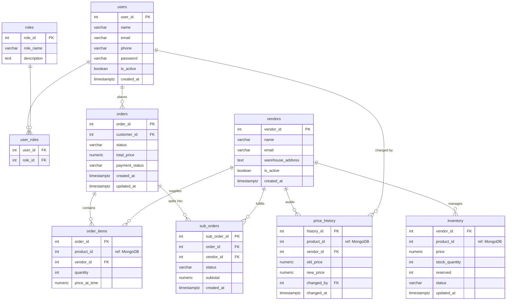

# Database Schema

## PostgreSQL — ERD & Định nghĩa bảng

### Sơ đồ quan hệ (ERD)



### Bảng chi tiết

#### `users`
> Lưu thông tin tài khoản người dùng. Mỗi user có thể là customer hoặc admin, phân biệt qua bảng `user_roles`. Password lưu dưới dạng bcrypt hash.

```sql
CREATE TABLE users (
    user_id     SERIAL PRIMARY KEY,
    name        VARCHAR(100) NOT NULL,
    email       VARCHAR(150) UNIQUE NOT NULL,
    phone       VARCHAR(20),
    password    VARCHAR(255) NOT NULL,     -- bcrypt hash
    is_active   BOOLEAN DEFAULT TRUE,
    created_at  TIMESTAMPTZ DEFAULT NOW()
);
```

#### `roles`
> Danh mục các vai trò trong hệ thống (`admin`, `customer`). Dùng để kiểm tra phân quyền tại middleware.

```sql
CREATE TABLE roles (
    role_id     SERIAL PRIMARY KEY,
    role_name   VARCHAR(50) UNIQUE NOT NULL,  -- 'admin', 'customer'
    description TEXT
);
```

#### `user_roles`
> Bảng trung gian cho quan hệ nhiều-nhiều giữa `users` và `roles`. Cho phép một user giữ nhiều role nếu cần mở rộng.

```sql
CREATE TABLE user_roles (
    user_id  INT REFERENCES users(user_id) ON DELETE CASCADE,
    role_id  INT REFERENCES roles(role_id) ON DELETE CASCADE,
    PRIMARY KEY (user_id, role_id)
);
```

#### `vendors`
> Lưu thông tin nhà cung cấp. Vendor không trực tiếp đăng nhập — admin là người quản lý thông tin và giá thay mặt vendor.

```sql
CREATE TABLE vendors (
    vendor_id         SERIAL PRIMARY KEY,
    name              VARCHAR(150) NOT NULL,
    email             VARCHAR(150),           -- nhận thông báo sub-order mới
    warehouse_address TEXT,
    is_active         BOOLEAN DEFAULT TRUE,
    created_at        TIMESTAMPTZ DEFAULT NOW()
);
```

#### `inventory`
> Mỗi dòng đại diện cho một sản phẩm cụ thể tại một vendor cụ thể. Lưu giá bán, số lượng tồn kho, và trạng thái bán. Tách thành bảng riêng để có thể dùng `SELECT ... FOR UPDATE` lock đúng row khi xử lý đơn hàng đồng thời, tránh lock toàn bảng.

```sql
CREATE TABLE inventory (
    vendor_id       INT REFERENCES vendors(vendor_id) ON DELETE CASCADE,
    product_id      INT NOT NULL,   -- tham chiếu sang MongoDB
    price           NUMERIC(15,2) NOT NULL,
    stock_quantity  INT NOT NULL DEFAULT 0 CHECK (stock_quantity >= 0),
    reserved        INT NOT NULL DEFAULT 0,
    status          VARCHAR(20) DEFAULT 'active'
        CHECK (status IN ('active', 'out_of_stock', 'inactive')),
    updated_at      TIMESTAMPTZ DEFAULT NOW(),
    PRIMARY KEY (vendor_id, product_id)
);
```

#### `orders`
> Đơn hàng tổng của khách, tổng hợp toàn bộ sản phẩm trong một lần mua. Theo dõi trạng thái vòng đời đơn hàng (`pending` → `confirmed` → `shipping` → `completed`) và trạng thái thanh toán độc lập.

```sql
CREATE TABLE orders (
    order_id        SERIAL PRIMARY KEY,
    customer_id     INT REFERENCES users(user_id),
    status          VARCHAR(20) NOT NULL DEFAULT 'pending'
        CHECK (status IN ('pending', 'confirmed', 'shipping', 'completed', 'failed', 'cancelled')),
    total_price     NUMERIC(15,2) NOT NULL,
    payment_status  VARCHAR(20) NOT NULL DEFAULT 'unpaid'
        CHECK (payment_status IN ('unpaid', 'paid', 'refunded')),
    created_at      TIMESTAMPTZ DEFAULT NOW(),
    updated_at      TIMESTAMPTZ DEFAULT NOW()
);
```

#### `order_items`
> Chi tiết từng sản phẩm trong đơn hàng. Lưu `price_at_time` là giá tại thời điểm đặt — giá này không thay đổi dù admin cập nhật giá sau đó. Là nguồn dữ liệu để tính `subtotal` của `sub_orders`.

```sql
CREATE TABLE order_items (
    order_id        INT REFERENCES orders(order_id) ON DELETE CASCADE,
    product_id      INT NOT NULL,   -- tham chiếu sang MongoDB
    vendor_id       INT REFERENCES vendors(vendor_id),
    quantity        INT NOT NULL CHECK (quantity > 0),
    price_at_time   NUMERIC(15,2) NOT NULL,
    PRIMARY KEY (order_id, product_id, vendor_id)
);
```

#### `sub_orders`
> Tách đơn hàng tổng thành các đơn con theo từng vendor. Mỗi sub-order có vòng đời trạng thái riêng, cho phép theo dõi việc xử lý, đóng gói, và giao hàng độc lập từ mỗi nhà cung cấp.

```sql
CREATE TABLE sub_orders (
    sub_order_id  SERIAL PRIMARY KEY,
    order_id      INT REFERENCES orders(order_id) ON DELETE CASCADE,
    vendor_id     INT REFERENCES vendors(vendor_id),
    status        VARCHAR(20) NOT NULL DEFAULT 'pending'
        CHECK (status IN ('pending', 'confirmed', 'shipping', 'completed', 'failed')),
    subtotal      NUMERIC(15,2) NOT NULL,
    created_at    TIMESTAMPTZ DEFAULT NOW()
);
```

#### `price_history`
> Audit log ghi lại mỗi lần admin cập nhật giá sản phẩm. Lưu cả giá cũ và giá mới để có thể truy vết toàn bộ biến động giá theo thời gian. Giá hiện tại của sản phẩm được đọc từ `inventory.price`, không phải từ bảng này.

```sql
CREATE TABLE price_history (
    history_id   SERIAL PRIMARY KEY,
    product_id   INT NOT NULL,
    vendor_id    INT REFERENCES vendors(vendor_id),
    old_price    NUMERIC(15,2) NOT NULL,
    new_price    NUMERIC(15,2) NOT NULL,
    changed_by   INT REFERENCES users(user_id),  -- admin user_id
    changed_at   TIMESTAMPTZ DEFAULT NOW()
);
```

### Indexes

```sql
-- Tối ưu query đọc từ Slave
CREATE INDEX idx_orders_customer       ON orders(customer_id, created_at DESC);
CREATE INDEX idx_orders_status         ON orders(status);
CREATE INDEX idx_order_items_product   ON order_items(product_id);
CREATE INDEX idx_price_history_product ON price_history(product_id, changed_at DESC);
CREATE INDEX idx_inventory_product     ON inventory(product_id);
```

### Triggers & Functions

#### Trigger 1: Trừ tồn kho khi order được confirmed
```sql
CREATE OR REPLACE FUNCTION fn_deduct_inventory()
RETURNS TRIGGER AS $$
BEGIN
    IF NEW.status = 'confirmed' AND OLD.status = 'pending' THEN
        UPDATE inventory i
        SET stock_quantity = stock_quantity - od.quantity,
            updated_at = NOW()
        FROM order_items od
        WHERE od.order_id = NEW.order_id
          AND i.vendor_id  = od.vendor_id
          AND i.product_id = od.product_id;
    END IF;
    RETURN NEW;
END;
$$ LANGUAGE plpgsql;

CREATE TRIGGER tr_deduct_inventory
AFTER UPDATE ON orders
FOR EACH ROW EXECUTE FUNCTION fn_deduct_inventory();
```

#### Trigger 2: Ghi lịch sử giá khi giá thay đổi
```sql
-- Trigger này được kích hoạt bởi Admin update giá
-- Xem chi tiết trong stored procedure fn_update_product_price
```

#### Function: Cập nhật giá và ghi audit
```sql
CREATE OR REPLACE FUNCTION fn_update_product_price(
    p_product_id  INT,
    p_vendor_id   INT,
    p_new_price   NUMERIC,
    p_changed_by  INT
) RETURNS VOID AS $$
DECLARE
    v_old_price NUMERIC;
BEGIN
    -- Lấy giá cũ (từ price_history gần nhất)
    SELECT new_price INTO v_old_price
    FROM price_history
    WHERE product_id = p_product_id
    ORDER BY changed_at DESC
    LIMIT 1;

    -- Ghi vào price_history
    INSERT INTO price_history (product_id, vendor_id, old_price, new_price, changed_by)
    VALUES (p_product_id, p_vendor_id, COALESCE(v_old_price, 0), p_new_price, p_changed_by);

    -- Cập nhật giá hiện tại trong inventory
    UPDATE inventory
    SET price = p_new_price, updated_at = NOW()
    WHERE vendor_id = p_vendor_id AND product_id = p_product_id;
END;
$$ LANGUAGE plpgsql;
```

#### Cursor: Thống kê bán hàng cuối tháng
```sql
CREATE OR REPLACE FUNCTION fn_monthly_vendor_commission(
    p_year  INT,
    p_month INT
) RETURNS TABLE(vendor_id INT, vendor_name VARCHAR, total_revenue NUMERIC) AS $$
DECLARE
    cur CURSOR FOR
        SELECT v.vendor_id, v.name,
               SUM(od.quantity * od.price_at_time) AS revenue
        FROM sub_orders so
        JOIN orders o ON o.order_id = so.order_id
        JOIN vendors v ON v.vendor_id = so.vendor_id
        JOIN order_items od ON od.order_id = o.order_id AND od.vendor_id = so.vendor_id
        WHERE o.status = 'completed'
          AND EXTRACT(YEAR FROM o.created_at) = p_year
          AND EXTRACT(MONTH FROM o.created_at) = p_month
        GROUP BY v.vendor_id, v.name;
    rec RECORD;
BEGIN
    OPEN cur;
    LOOP
        FETCH cur INTO rec;
        EXIT WHEN NOT FOUND;
        vendor_id     := rec.vendor_id;
        vendor_name   := rec.name;
        total_revenue := rec.revenue;
        RETURN NEXT;
    END LOOP;
    CLOSE cur;
END;
$$ LANGUAGE plpgsql;
```

#### View phân quyền
```sql
-- Customer chỉ thấy đơn hàng của mình (áp dụng Row-Level Security)
CREATE VIEW vw_customer_orders AS
SELECT order_id, status, total_price, payment_status, created_at
FROM orders
WHERE customer_id = current_setting('app.current_user_id')::INT;

-- Admin thấy toàn bộ
CREATE VIEW vw_admin_orders AS
SELECT o.*, u.name AS customer_name, u.email
FROM orders o
JOIN users u ON u.user_id = o.customer_id;
```

---

## MongoDB — Product Document Schema

### Collection: `products`

```json
{
  "_id": 2001,
  "name": "Dell XPS 15 9530",
  "category": "Laptop",
  "brand": "Dell",
  "images": ["url1", "url2"],
  "specs": {
    "cpu": "Intel Core i9-13900H",
    "ram": "32GB DDR5",
    "ssd": "1TB NVMe",
    "gpu": "NVIDIA RTX 4060",
    "screen": "15.6 inch OLED",
    "battery": "86Wh",
    "weight": "1.86kg"
  },
  "created_at": "2024-01-01T00:00:00Z",
  "updated_at": "2024-01-01T00:00:00Z"
}
```

```json
{
  "_id": 2002,
  "name": "iPhone 15 Pro Max",
  "category": "Smartphone",
  "brand": "Apple",
  "images": ["url1"],
  "specs": {
    "chipset": "Apple A17 Pro",
    "screen": "6.7 inch Super Retina XDR",
    "battery": "4422mAh",
    "camera": "48MP Main + 12MP Ultra Wide + 12MP Telephoto",
    "storage_options": ["256GB", "512GB", "1TB"],
    "os": "iOS 17"
  },
  "created_at": "2024-01-01T00:00:00Z",
  "updated_at": "2024-01-01T00:00:00Z"
}
```

```json
{
  "_id": 2003,
  "name": "Sony Alpha A7 IV",
  "category": "Camera",
  "brand": "Sony",
  "images": ["url1"],
  "specs": {
    "sensor": "33MP Full-Frame BSI CMOS",
    "iso": "100-51200 (expandable 50-204800)",
    "autofocus": "759-point phase-detect",
    "video": "4K 60p",
    "mount": "Sony E-mount",
    "weight": "659g"
  },
  "created_at": "2024-01-01T00:00:00Z",
  "updated_at": "2024-01-01T00:00:00Z"
}
```

### Indexes MongoDB

```javascript
db.products.createIndex({ "category": 1 });
db.products.createIndex({ "brand": 1 });
db.products.createIndex({ "name": "text" });  // full-text search
```

---

## Master-Slave Replication Setup

### Cấu hình PostgreSQL Streaming Replication

```
Master (HCM): postgresql.conf
  wal_level = replica
  max_wal_senders = 3
  wal_keep_size = 256MB

Slave (HN): recovery.conf / postgresql.conf
  primary_conninfo = 'host=pg-master port=5432 ...'
  hot_standby = on       ← cho phép READ trên slave
  hot_standby_feedback = on
```

### Read/Write Splitting trong Node.js

```javascript
// config/database.js
const { Pool } = require('pg');

const masterPool = new Pool({
  host: process.env.PG_MASTER_HOST,
  port: 5432,
  database: 'ecommerce',
  user: process.env.PG_USER,
  password: process.env.PG_PASSWORD,
  max: 20,
});

const slavePool = new Pool({
  host: process.env.PG_SLAVE_HOST,
  port: 5432,
  database: 'ecommerce',
  user: process.env.PG_READONLY_USER,
  password: process.env.PG_READONLY_PASSWORD,
  max: 30,  // Slave chịu nhiều READ hơn
});

module.exports = { masterPool, slavePool };
```

### Fallback khi Slave lag hoặc sập

- Nếu Slave unreachable → API Server tự fallback sang Master cho READ
- Cấu hình health check 30s để phát hiện slave down
- Alert khi replication lag > 500ms
